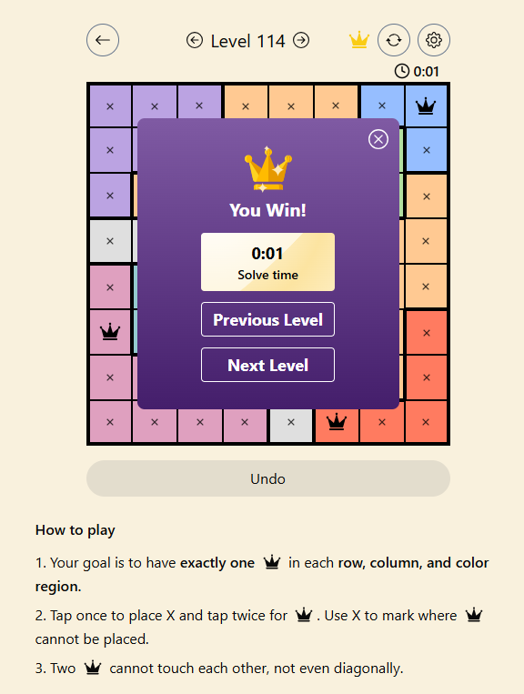

# LinkedIn Queens Game Solver
Python solution for automatically solving levels in LinkedIn's "Queens" Daily Puzzle


> [Capture from queensgame.vercel.app](https://queensgame.vercel.app/)

This script automates solving and interacting with a color-region variant of the N-Queens puzzle, as seen in certain online logic games.

## Game Rules

- Your goal is to have exactly one queen in each row, column, and color region.
- Tap once to place X and tap twice for queen. Use X to mark where queens cannot be placed.
- Two queens cannot touch each other, not even diagonally.

## How It Works

1. **Screenshot Capture**: The script takes a screenshot of your screen to find the game board.
2. **Board Detection**: It detects the board by looking for a square region with a dark border. If the board is not found, it keeps retrying until it appears.
3. **Grid Analysis**: The script splits the board into cells and analyzes the color at each cell to identify contiguous color regions.
4. **Region Assignment**: Each contiguous color region is assigned a unique ID.
5. **Queen Placement Solver**: Using a backtracking algorithm, the script finds a solution where each row, column, and color region contains exactly one queen, and no two queens touch (even diagonally).
6. **Automated Input**: The script uses `pyautogui` to double-click the correct cells on the board to place the queens.

## Usage

1. Open the game in your browser and make sure the board is fully visible on your screen.
2. Run the script:

```bash
python queens.py
```

3. The script will wait until it detects the board, then solve the puzzle and automatically place the queens.

- A screenshot (`debug_screenshot.png`) is saved each time the board is checked, for debugging purposes.

## Requirements

- Python 3.7+
- Windows OS (uses `ImageGrab` for screenshots)
- The following Python packages:
  - opencv-python
  - numpy
  - pyautogui
  - pillow

Install dependencies with:

```bash
pip install -r requirements.txt
```

## Troubleshooting

- If the script cannot find the board, try adjusting your browser zoom or scrolling so the board is fully visible and square.
- The script saves a screenshot (`debug_screenshot.png`) for debugging board detection issues.
- Make sure no other windows cover the game board.

## Disclaimer
This script is for educational and personal automation use only. Use responsibly and respect the terms of service of the game website.
